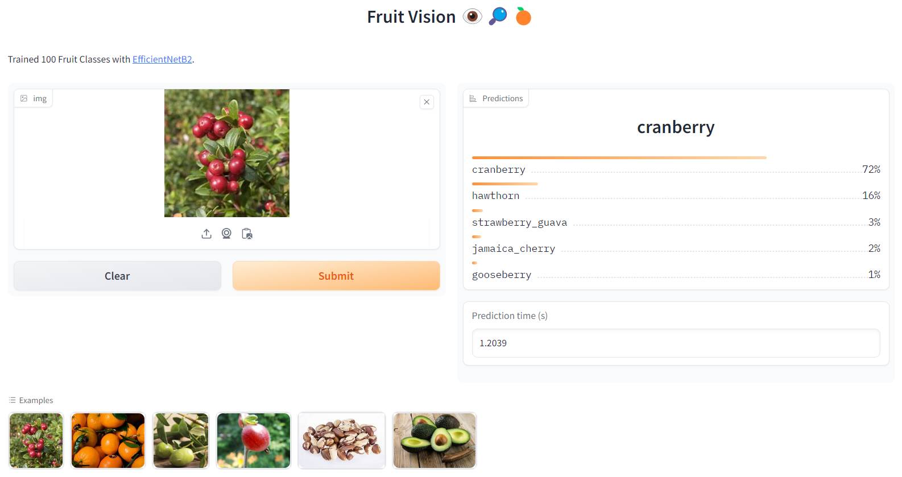

## Fruit Vision 100

### Jupyter Notebook Experiments

- [Fruit Vision 100 - Source Code](https://github.com/andrewtclin/fruit_vision_model/blob/master/fruit_vision_100.ipynb)

### Deployed model @ HuggingFace:

- [Fruit Vision 100 - App](https://huggingface.co/spaces/tclin/fruit_vision_100)

### Overview

- This project trains a computer vision model to identify **100 different fruit classes** (transfer learning of EfficientNetB2).
- Portable model: **9.1M** parameters.

### Highlights

- Source of data: [Data Retrieved from Kaggle](https://www.kaggle.com/datasets/marquis03/fruits-100)
- Trained using **20%** of the training data.
